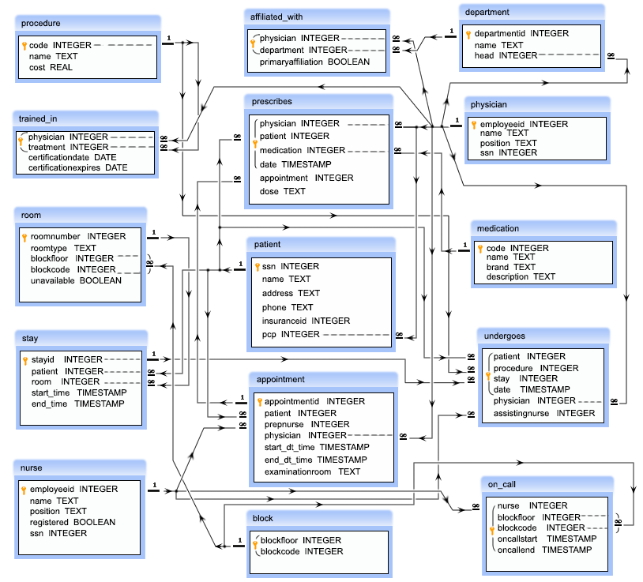

# Hospital  Database Model

This project base on hospital management system. It's facilitate to run hopital and record all data. 

In this project have 15 tables:

**proceduree** 

**trained_in**

**room**

**stay**

**nurse**

**affilated_with**

**prescribe**

**patient**

**appointment**

**block**

**department**

**physician**

**medication**

**undergoes**

**on_call**

# Entity Relationship Diagram

